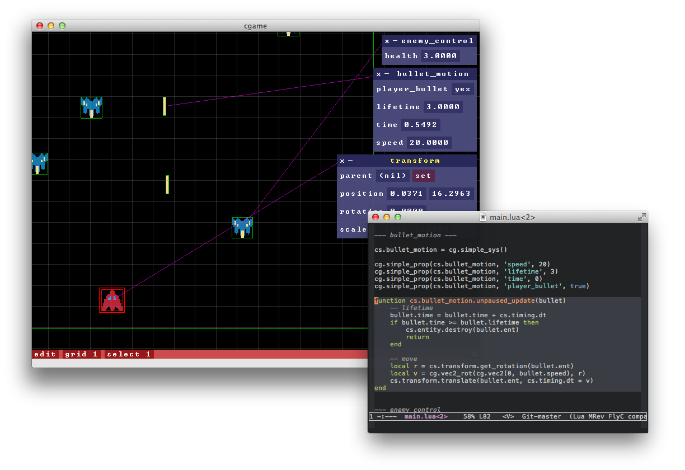

NOTE: the 'cgame' executable looks for data in './data' so make sure you run it
with the repository root as working directory

test/keyboard_controlled.{c,h} shows an example of implementing a system in C.
It allows control of the transform of an object through the arrow keys, M/N
keys to rotate and I/K keys to scale. This works even when attached to the
camera, in which case I/K can be used to zoom in and out (this is an effect of
how transform scaling affects the camera).

data/test/oscillator.lua and data/test/rotator.lua show examples of
implementing systems in Lua. Again these systems can also be attached to the
camera to oscillate/rotate it. test/test.c shows how to set up entities in C,
and data/test/test.lua shows the same in Lua.

Building
---

CMake should make it easy to set up. [GLFW](http://www.glfw.org/),
[GLEW](http://glew.sourceforge.net/),
[stb_image](http://code.google.com/p/stblib/), [LuaJIT](http://luajit.org/),
[chipmunk](http://chipmunk-physics.net/) are dependencies and are included in
ext/. From the repository root,

    mkdir build
    cd build
    cmake ..
    make

Running
---

After building just run the 'cgame' executable, making sure your working
directory is the root of the project (cgame looks for data in './data'). So
after running the commands in the previous section, you'd do,

    cd ..
    ./build/cgame

